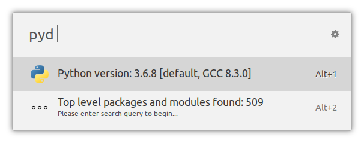
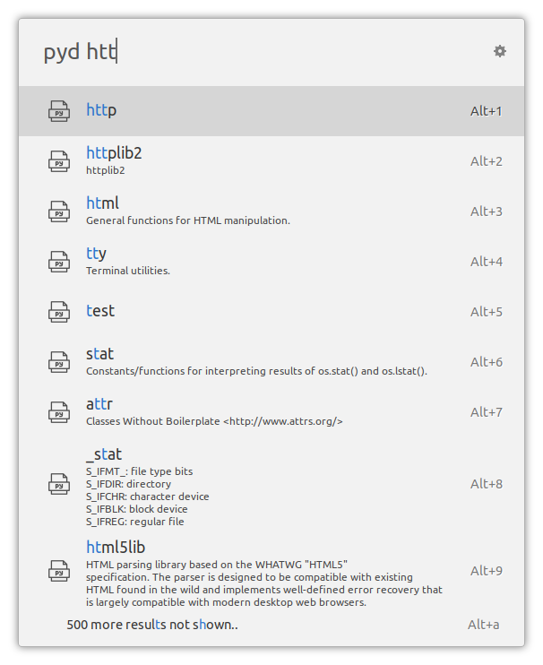
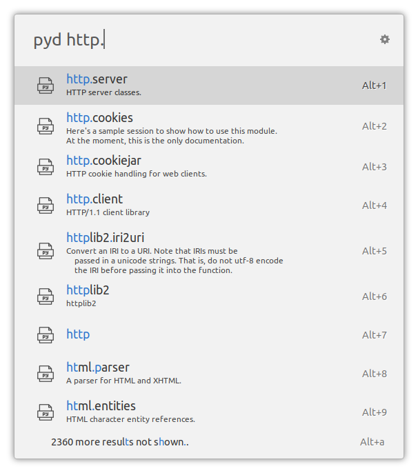
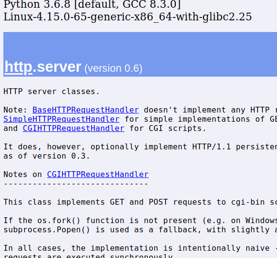

# ulauncher-pydoc

A [Ulauncher](https://ulauncher.io/) extension to search and view installed Python modules' and packages' built-in documentation. Uses the `pydoc` module that comes with Python to generate the documentation and make it available via HTTP.


## Usage

Open Ulauncher and type in "pyd " to start the extension. If everything is configured correctly, you'll see information about your system-installed Python 3 version and its packages:



Start typing a search query to get search results. It uses the same fuzzy string search algorithm as Ulauncher itself.



Use dot `.` to search submodules and nested packages:



Select a module or package and press Enter to see its documentation (generated by `pydoc`) in the browser:




## Installation

Open Ulauncher preferences window -> Extensions -> "Add extension" and paste the following url:

```
https://github.com/pbkhrv/ulauncher-pydoc
```


## Development

Install necessary packages:

`pip install -r dev/requirements.txt`

Run unit tests:

`make test`

Quit Ulauncher. Then run it in debug mode:

`make run_ul`

Run extension in the terminal, connecting to Ulauncher in debug mode:

`make run`

(if that doesn't work, check the connection string URL printed out by Ulauncher and modify the Makefile accordingly.)

**Contributions are welcome!**

## License

[MIT license](LICENSE)
