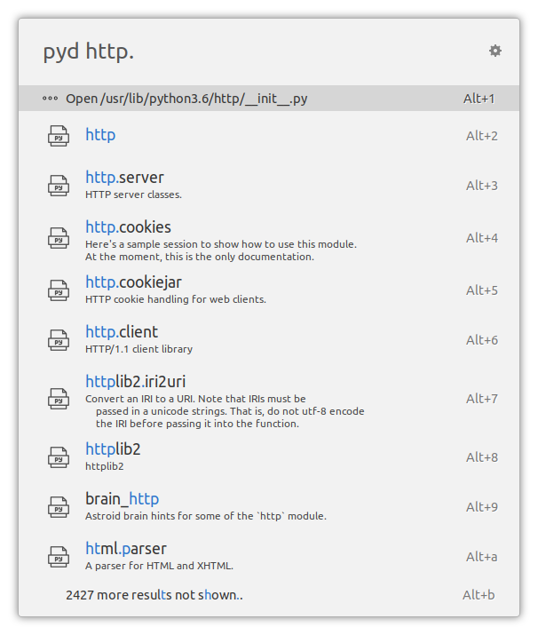
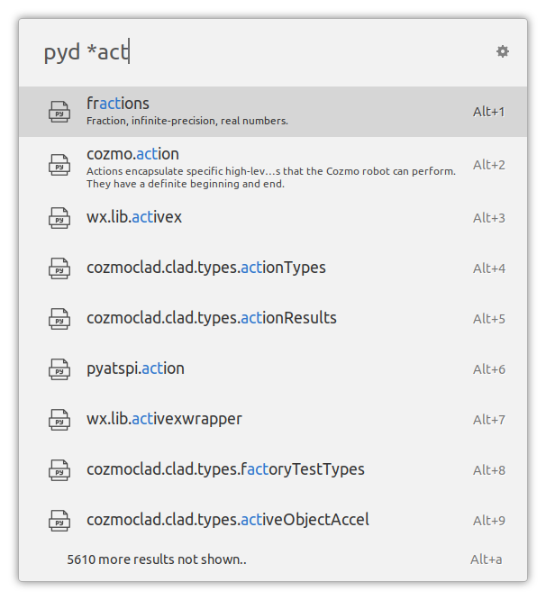

# ulauncher-pydoc

A [Ulauncher](https://ulauncher.io/) extension to search and view installed Python modules' and packages' documentation derived from docstrings. It uses the `pydoc` module from the Python standard library to generate the documentation and make it available via HTTP.


## Usage

Open Ulauncher and type in "pyd " to start the extension. If everything is configured correctly, you'll see information about your system-installed Python 3 version and its packages:


Start typing a query to search for a matching top level package or module name. It uses the same fuzzy string search algorithm as Ulauncher itself.


Type in `.` (dot) after the package name to search submodules and nested packages, or press Alt+Enter to complete the name of the selected search result item.

Whenever there's an exact match on the query, you can choose to open that module's source file in your default editor:



Use a wildcard `*` to match on any part of the name, regardless of the nesting level:



Characters before the wildcard must be present in the name for it to match:


Select a module or package and press Enter to see its documentation (generated by `pydoc`) in the browser:


## Installation

Open Ulauncher preferences window -> Extensions -> "Add extension" and paste the following url:

```
https://github.com/pbkhrv/ulauncher-pydoc
```


## Development

I use the following tools while working on this extension:

- [`Black`](https://github.com/psf/black) code formatter
- `pytest`
- `pylint` with the `flake8` plugin
- `mypy` static type checker

You can install them in one shot (except for `Black` - that's up to you) by running:

```shell
pip install -r scripts/requirements.txt
```

Check PEP8 compliance, perform static type analysis and run unit tests:

```shell
make test
```

Backup the "production" version of the extension and symlink the development version into Ulauncher's extension directory:

```shell
make symlink
```

Quit Ulauncher. Then run it in debug mode:

```shell
make run_ul
```

Run extension in the terminal, connect it to Ulauncher in debug mode:

```shell
make run
```

(if that doesn't work, check the connection string URL printed out by Ulauncher and modify the Makefile accordingly.)

Unlink the development version of the extension from Ulauncher and replace it with whatever was there before:

```shell
make unlink
```

## Contributions

Issues and pull requests are welcome!


## License

MIT license. See [LICENSE](LICENSE) file for details.
